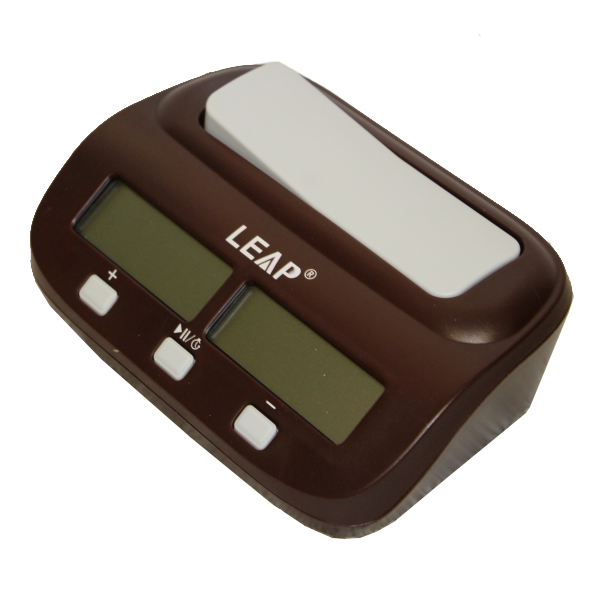

# PyProductivity

    

---

## What

---

An app that helps me track my productivity time and displays some simple reports about it

---

## Why

---

To learn, and to make editing a `CSV` easier

---
